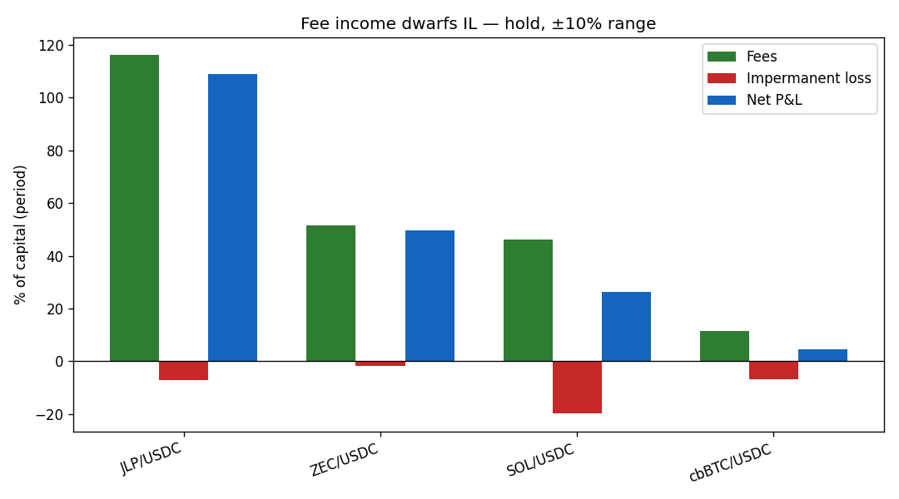
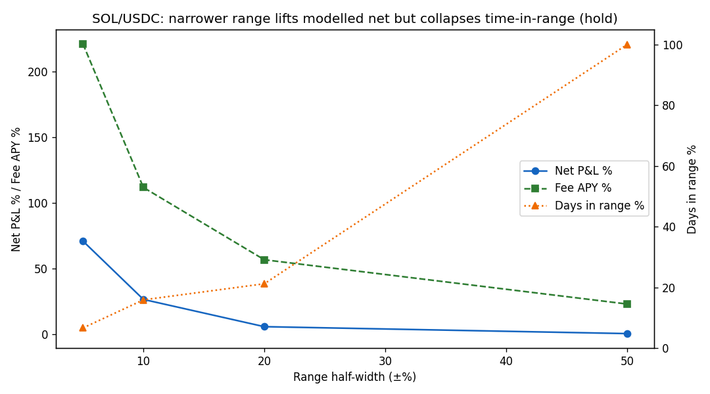
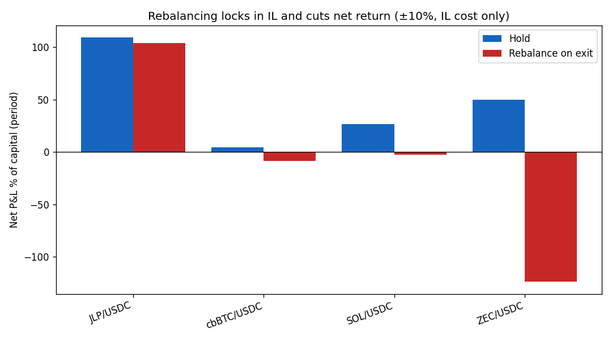

# When is a Solana CLMM LP position profitable? Fees vs impermanent loss

A small empirical study of concentrated-liquidity (CLMM) LP returns on Orca, run
on **real on-chain price + volume history** through the same math that powers the
`tick-liq` live inspector. The goal is twofold: arrive at a practical answer, and
be honest about exactly what the model does and does not capture.

> **TL;DR.** Over Jan–May 2026, *holding* a concentrated LP position across six
> USDC-quoted Orca pools was net-positive — fee income exceeded impermanent loss
> in every pool. Two caveats do the real work: (1) the model credits fees even
> while the position is out of range, so it **overstates** narrow-range returns —
> a real LP earns nothing out of range, and narrow ranges are out of range most
> of the time; (2) **rebalancing** to chase the range realises IL on every
> re-center and usually *cuts* net return, badly on volatile pools. Net of the
> hype: LP profitability is a bet that fee revenue outruns IL; concentration and
> rebalancing both cut against that more than they first appear.

## Method

- **Data.** Daily OHLCV (price + USD volume) per pool from the free, key-less
  [GeckoTerminal API](https://www.geckoterminal.com/dex-api), 2026-01-01 → 2026-06-01.
- **Pipeline.** `cargo run -- research` backtests a matrix of
  **(pool × range-width × rebalance)** fully in memory: OHLCV → synthesised
  `pool_ticks` → the CLMM P&L replay → risk metrics. No database. One CSV row per
  run (`research/data/results.csv`); charts via `research/analyze.py`.
- **Fee synthesis.** GeckoTerminal gives volume, not on-chain `fee_growth`. Pool
  fees over a candle are reconstructed as `volume · fee_rate`, attributed to the
  quote (USDC) side, scaled by a constant pool-liquidity snapshot read on-chain.
  A replayed position then earns its share `volume · fee_rate · (L_pos / L_pool)`.
- **Comparability.** Every run deploys the same **$10,000**; position liquidity
  is scaled so the position is worth that at entry. Because fee%, IL% and net%
  are invariant to absolute L, pools and widths compare directly.
- **Honesty filter.** Each run reports `pool_share = L_pos / L_pool`. When it is
  not small the constant-L approximation overstates fees, so quantitative charts
  drop runs with `pool_share ≥ 0.25` (this excludes the thin **JUP/USDC** pool
  entirely and the narrowest **JLP** runs).

Six pools span the volatility spectrum: JLP (0.41) · cbBTC (0.51) · SOL (0.67) ·
JUP (0.83) · ZEC (1.35) · Fartcoin (annualised realised vol).

## Experiment 1 — fee income vs impermanent loss



Holding a ±10% position, **fee income exceeded IL in every pool**, so net P&L was
positive everywhere: JLP +109%, ZEC +50%, SOL +26%, cbBTC +4.5% of capital over
five months. IL was modest by comparison (−1.7% to −19.8%).

**Read it carefully.** The *ranking* and the *fees-beat-IL* direction are robust;
the absolute magnitudes are not — they ride on the volume-share + constant-L fee
model and a single liquidity snapshot. Treat "fees > IL" as the finding, not the
exact percentages.

## Experiment 2 — the range-width trade-off (the knob that lies)



On SOL/USDC, narrowing the range raises modelled net return monotonically — ±5%
shows +71% net vs +0.4% at ±50%. The naive takeaway would be "go as narrow as
possible." **That is a model artifact.** The `days-in-range` line tells the truth:
at ±5% the position is in range only **6.6%** of the period, yet the fee model
(range-independent by construction, `T-03-09`) keeps crediting fees as if it were
always active. A real ±5% LP, out of range 93% of the time, would earn a small
fraction of those fees.

The honest insight: there is a genuine tension between fee concentration and
time-in-range that the simplest model hides. A practitioner should favour a
**moderate** range and watch time-in-range, not chase the narrowest band.

## Experiment 3 — rebalancing to stay in range



Rebalancing on every range exit keeps the position in range (time-in-range rises
to 77–98%) but **realises IL at each re-center**, and net return falls in every
pool — mildly on low-vol JLP (+109% → +104%), severely on high-vol ZEC
(+50% → **−124%**). Re-centering after a move is "sell low, buy high" on repeat.

**The strongest caveat in this study.** Because the fee model is
range-independent, fees are *identical* hold-vs-rebalance here, so the chart
captures only rebalancing's IL **cost**, not the extra fees a real rebalance earns
by staying in range. Read it as an upper bound on the harm — the real trade-off is
"more fees vs more realised IL," and this model only sees the second half.

## What this does and does not establish

**Supported:** fee revenue is the dominant term in CLMM LP P&L over this window;
IL is real but smaller; rebalancing carries a material, vol-scaling IL cost.

**Model limitations (do not over-read the numbers):**

- **Range-independent fees (`T-03-09`).** Fees are credited from global
  fee-growth × position L, regardless of in-range status — overstating narrow
  ranges and the case against rebalancing. The single biggest distortion here.
- **Constant pool liquidity.** A one-time on-chain snapshot; real L moves, and
  fee magnitudes scale inversely with it. `pool_share` flags where this bites.
- **Quote-side fees / no gas, no slippage, no rebalance transaction cost.**
- **Daily granularity** misses intraday range exits; **GBM-free** but only as good
  as GeckoTerminal's volume.
- **One five-month window**, six pools — directional, not a backtest you would
  trade on.

The point of stating these plainly: the model is good enough to rank pools and
expose the fee-vs-IL and concentration-vs-coverage tensions, and honest enough to
stop you trusting a 555%-APY headline.

## Reproduce

```bash
cargo run -- research --config research/experiments.toml --out research/data/results.csv
pip install -r research/requirements.txt
python research/analyze.py   # writes research/charts/*.png
```
